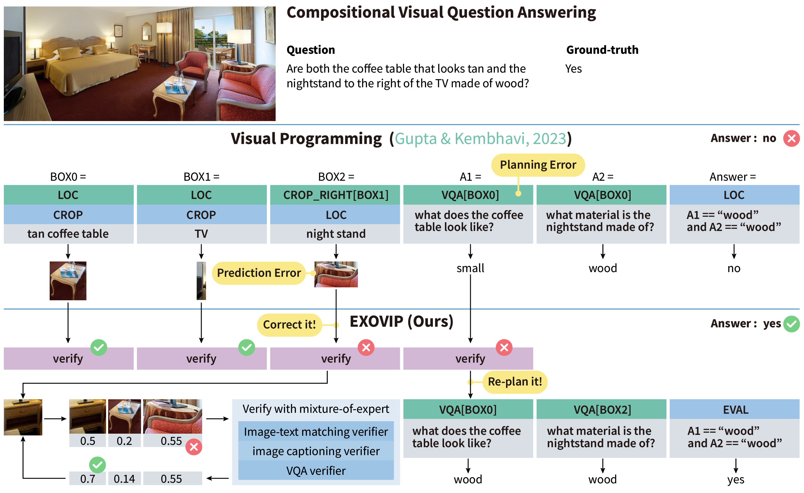
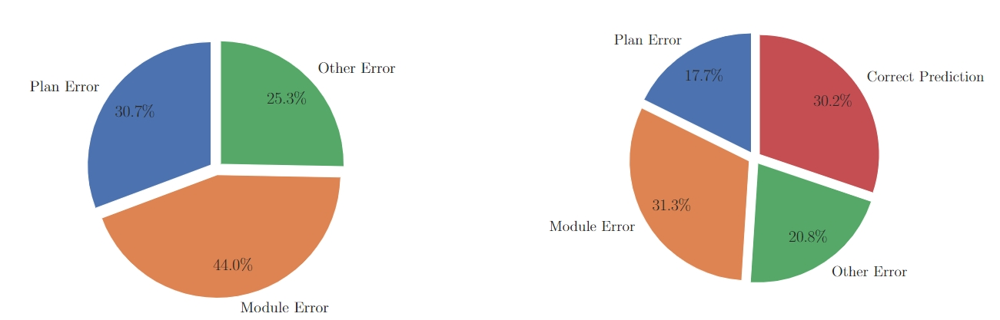

<div align="center">

# ExoViP: Step-by-step Verification and Exploration with Exoskeleton Modules for Compositional Visual Reasoning

[](https://arxiv.org/abs/2408.02210)
[](https://colmweb.org/)

</div>

Official implementation of our paper: ExoViP: Step-by-step Verification and Exploration with Exoskeleton Modules for Compositional Visual Reasoning



## Introduction

In this work, we devise a "plug-and-play" method, ExoViP, to correct the errors at both the planning and execution stages through introspective verification. We employ verification modules as "exoskeletons" to enhance current vision-language programming schemes. Specifically, our proposed verification module utilizes a mixture of three sub-verifiers to validate predictions after each reasoning step, subsequently calibrating the visual module predictions and refining the reasoning trace planned by LLMs.

## Envirionment

Paste your OPENAI-API-KEY and OPENAPI-API-BASE to `engine/.env` and `tasks/*.ipynb`

```
conda env create -f environment.yaml
conda activate exovip
```

If the Huggingface is not available of your network, you can download all checkpoints under `prev_trained_models` directory

## Highlights

Errors in existing methods could be summarized to two  categories:

- Module Error: The visual modules are not able to correctly execute the program
- Planning Error: LLM can not parse the language query into a correct solvable program


We conducted a comparative analysis of the statistics derived from a random sample of 100 failure incidents before (left) and after (right) the implementation of our method.



## Start

Our method has been validated on six tasks:

- Compositional Image Question Answering: [GQA](https://cs.stanford.edu/people/dorarad/gqa/about.html)
- Referring Expression Understanding: [RefCOCO/RefCOCO+/RefCOCOg](https://github.com/lichengunc/refer)
- Natural Language for Visual Reasoning: [NLVR](https://github.com/lil-lab/nlvr/tree/master/nlvr2)
- Visual Abstract Reasoning: [KILOGRAM](https://github.com/lil-lab/kilogram)
- Language-guided Image Editing: [MagicBrush](https://github.com/OSU-NLP-Group/MagicBrush)
- Spatial-Temporal Video Reasoning: [AGQA](http://ai.stanford.edu/blog/agqa/)

***NOTE**: All the experiments are applied on subsets of these datasets, please refer to `datasets`*

code demos

```bash
cd tasks

# GQA
gqa.ipynb

# NLVR
nlvr.ipynb

# RefCOCO(+/g)
refcoco.ipynb

# KILOGRAM
kilogram.ipynb

# MagicBrush
magicbrush.ipynb

# AGQA
agqa.ipynb
```

## Available Modules


## Examples


## Acknowledgement

[visprog](https://github.com/allenai/visprog), a neuro-symbolic system that solves complex and compositional visual tasks given natural language instructions


## Citation

If you find our work helpful, please cite it.

```bibtex
@inproceedings{wang2024exovip,
    title={ExoViP: Step-by-step Verification and Exploration with Exoskeleton Modules for Compositional Visual Reasoning},
    author={Wang, Yuxuan and Yuille, Alan and Li, Zhuowan and Zheng, Zilong},
    booktitle={The first Conference on Language Modeling (CoLM)},
    year={2024}
}
```
